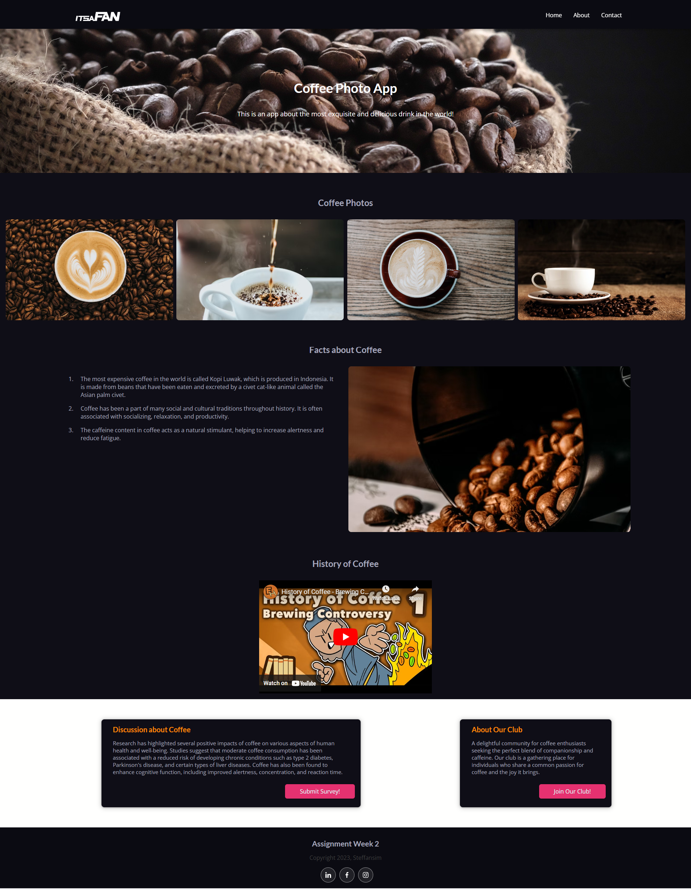

# Simple Coffee Enthusiast Website using HTML, CSS, & JavaScript.
This website is made for RevoU assignment.
The purpose for this assignment is to implement responsive design about anything that I like. Since I love coffee and always drink it everyday, then I decided to make the website about coffee. This website design based on the example provided for the assignment.

## This is the website link:
Click here: https://steffan-revou-week2.netlify.app/

### Desktop View Screenshot

  

